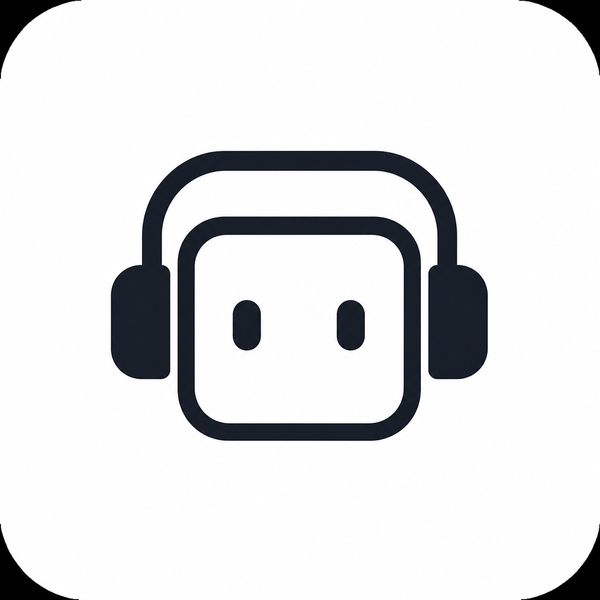

<p align="center">
  
</p>

<h1 align="center">RE-KORD 3.4</h1>

<p align="center">
  <strong>Your local music hub.</strong> One interface to listen, organize, enrich your library, and play with the music — on your disk, on your network, under your control.
</p>

<p align="center"><em>Exact semver in <code>package.json</code> · UI in English and Italian</em></p>

> **Stable release line:** **3.4** is the rebuilt, pack-tested branch (no server-side `sharp` for covers, DiscoWall in Studio → Listen). Earlier **3.3** tags on GitHub used a different stack and are not recommended for new installs.

---

## Why RE-KORD

RE-KORD is not a cloud service: it is **home for your audio**. It indexes the folder you choose, keeps queue, playlists, favorites, and stats per profile, and gives you studio-grade tools built in. Open the player in **Studio → Listen**, pick a **visualizer** (including **DiscoWall**), or launch **Plectr** on the track that is playing.

Built for **legal libraries** (rights-free music, your own productions, podcasts, material you are allowed to use). You decide what to import; RE-KORD helps you manage it.

---

## Everything RE-KORD does

### Command center

| Area | What you get |
| --- | --- |
| **Dashboard** | Artists / albums / tracks overview, highlighted favorites, recently updated albums, **instant mix** by genre and mood, resume listening session, library quality alerts (covers, metadata, loose-track folders). |
| **Library** | Browse by **artists, genres, and moods**; quick search (`Ctrl+K`); sort modes; album and track sheets; edit titles, tags, **LRC** or plain lyrics; **smart shuffle** exclusions (single track, whole album, genre). |
| **Studio** | One workspace with tabs: **Listen** (now playing, queue, lyrics, visualizer), catalog discovery, download, metadata, artwork. |
| **Plectr** | Rhythm game on generated charts, synced with the player. |
| **Queue · Playlists · Favorites · Recent** | Full session management: reorder, repeat, save sets, jump back in time. |
| **Statistics** | Top tracks, artists, albums, and genres; filters for plays, favorites, and shuffle blocks. |
| **Achievements** | XP progression, levels, daily streak, dozens of badges (plays, favorites, playlists, library, Plectr…). |
| **Settings** | Library root, local accounts, theme and visualizer, LAN / Cloudflare, backup, activity log, YouTube cookies for downloads. |

### Listening and player

- **Persistent player** with queue, shuffle, repeat (off / all / one), volume, session restore on launch.
- **Listen** (Studio tab): now playing, up-next queue, shuffle across the library, recent history, **lyrics** panel (synced LRC or plain text), and the active **visualizer** on the player.
- **Crossfade** (off, 3 s, 5 s) between tracks and softer UI transitions when artwork changes.
- **Visualizer** modes (Settings → Theme and visualizer): **bars**, **mirror**, **wave**, **smooth wave**, **H·M·B waves**, **signals**, **DiscoWall**, **karaoke** — all driven by live audio analysis on the playing track. **DiscoWall** is a grid “light wall” (audio energy plus Plectr chart data when a chart exists); it is not a separate app section.
- **Google Cast** (Remote Playback) where the browser supports it.
- **Mobile dock**: compact controls, swipe between tracks, quick access to Plectr and sections.

### Studio — your post-production room

- **Listen** — player, queue, lyrics, and visualizer (same modes as in Settings).
- **Discover** — **local** catalog (per-account artist/album selection) and **web** suggestions (preview and download into the library).
- **Download** — `yt-dlp` bundled in Server packs; single, playlist/album, artist discography; classic and **explore** UI; folders under *Music*; progress and cancel; native AAC/Opus (m4a/webm) without ffmpeg in RE-KORD; optional YouTube cookies.
- **Metadata** — album and track enrichment (MusicBrainz / iTunes and RE-KORD pipeline), bulk scan, heuristic **title cleanup**, prune orphan track metadata.
- **Covers** — artwork search and apply to album folders (full-size files served by the API; resized in the browser).

### Plectr

- **Plectr** (main nav) — rhythm game on charts generated from audio: **easy / normal / hard**, tap / hold, score, combo, accuracy, **per-track records** (per account), **live sync** with the player (follow the track already playing). Open from the nav or with **P** while a queue is active.

### Personalization and profiles

- **Themes** — preset palettes (light/dark, Prism Engine, custom colors).
- **Languages** — **English** or **Italian** UI.
- **Local accounts** — multiple profiles on one machine, each with state (favorites, playlists, stats, Plectr records, shuffle exclusions) under `.kord/` in the library.
- **Backup and restore** — ZIP of settings and state; browsable server activity log.

### Network and distribution

- **Node server + React UI** — API and interface from one install; filesystem index of the *music root*.
- **LAN** — listens on all interfaces by default: other devices open `http://<IP>:<port>` (firewall permitting).
- **External access** — **Cloudflare** tunnel from Settings (quick trycloudflare URL or stable named tunnel).
- **Electron** — full desktop app; **RE-KORD Server** (server + yt-dlp per target OS); **RE-KORD Client** (UI only, points at an existing server).

---

## Disclaimer

RE-KORD and its creators **are not responsible** for what users download, import, or manage. Each user is **solely responsible** for copyright and local law compliance. Use only content you have rights or permission to use.

---

## Technical (brief)

### Requirements

- Recent **Node.js** (development and from-source use).
- A folder of audio files.
- **yt-dlp** optional in dev (`PATH` or `YTDLP_PATH`); included in **`pack:*:server`** builds per target OS.

### Quick start

```bash
npm install
npm run dev          # browser: Vite :5173 + API :3001
npm run dev:app      # Electron + server in userData
```

Library root: `MUSIC_ROOT` or Settings. Server config dir: `REKORD_USER_CONFIG_DIR` (legacy: `WPP_USER_CONFIG_DIR`).

| Variable | Effect |
| --- | --- |
| `REKORD_LISTEN_HOST=127.0.0.1` | Loopback only (no LAN) |
| `REKORD_PORT` / `KORD_PORT` / `PORT` | HTTP port |
| `REKORD_YTDLP_COOKIES` | Netscape cookies file for downloads |
| `REKORD_LISTEN_ON_LAN=1` | Expose Vite dev server on LAN |

### Build and release 3.4

```bash
npm run build
npm test && npm run lint

# Recommended: versioned Server / Client packs (uses electron-builder.rekord.cjs)
npm run pack:linux:server -- 3.4.0   # → release/RE-KORD-Server-3.4.0-linux-x64.AppImage
npm run pack:win:server -- 3.4.0    # → RE-KORD Server .exe (build on Windows for NSIS)
npm run pack:linux:client -- 3.4.0  # → RE-KORD-Client-… (UI only, remote server)
npm run pack:win:client -- 3.4.0

npm run pack              # generic electron-builder on current OS → release/
```

On Linux without `libfuse2`, start the AppImage with:

```bash
./scripts/run-linux-appimage.sh
# or: APPIMAGE_EXTRACT_AND_RUN=1 ./release/RE-KORD-Server-3.4.0-linux-x64.AppImage
```

Server packs bundle **yt-dlp** and **cloudflared** for the target OS, run `vite build`, and ship `dist/`, `server/`, and `public/REKORDlogo.png`. Existing libraries keep data under **`.kord/`** (unchanged on disk).

Windows: prefer building **on Windows** for installers. Linux Electron: `ELECTRON_DISABLE_SANDBOX=1` if needed. On Linux, cross-building Windows may yield a `.7z` unless `REKORD_WIN_INSTALLER=1` on a Windows host.

### Repo (at a glance)

| Path | Role |
| --- | --- |
| `src/` | React, player, routing, i18n, Plectr game |
| `server/` | Express, library index, downloads, state in `MUSIC_ROOT/.kord/` |
| `electron/` | Main process, RE-KORD Client connect flow |

**Scripts:** `dev` · `dev:app` · `build` · `test` · `lint` · `pack` / `pack:linux|win|mac` · `pack:*:server|client`

**Main API:** `/api/library` · `/api/library-index` · `/api/dashboard` · `/api/user-state` · `/api/download` · `/api/artwork/*` · `/api/album-info/*` · `/api/track-info/*` · `/api/fs/*`

**Publishers:** default LAN bind — restrict with `REKORD_LISTEN_HOST` when remote access is not wanted; `pack:*:server` for Studio with bundled yt-dlp; build on the target OS when possible.

---

<p align="center"><em>RE-KORD 3.4 by Creiv — local music, serious tools, play on the beat.</em></p>
