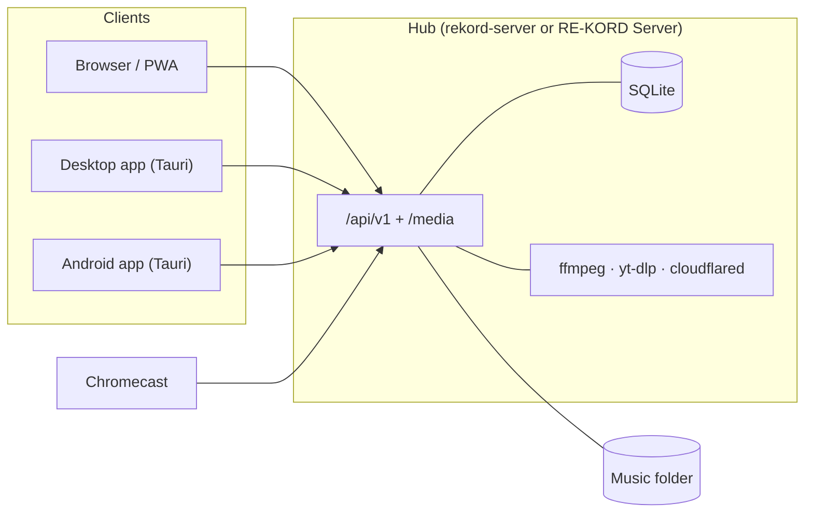

<p align="center">
  
</p>

<h1 align="center">RE-KORD</h1>

<p align="center">
  <strong>Your music. Your server. Your rules.</strong><br />
  A self-hosted music hub that turns a folder of audio files into a complete listening,
  curation and play experience, on your disk, on your network, under your control.
</p>

<p align="center">
  <a href="https://github.com/Creiv/RE-KORD/actions/workflows/ci.yml"></a>
  <a href="https://github.com/Creiv/RE-KORD/releases"></a>
</p>

<p align="center">
  <a href="https://re-kord.com"><strong>re-kord.com</strong></a> ·
  <a href="https://www.reddit.com/r/RE_KORD/"><strong>r/RE_KORD</strong></a> ·
  <a href="docs/user-guide.md"><strong>User guide</strong></a> ·
  <a href="https://github.com/Creiv/RE-KORD/releases"><strong>Downloads</strong></a>
</p>

---

RE-KORD is **not a cloud service**. Point it at your music folder and it becomes your
personal music server: a fast library with rich metadata, a serious player with
visualizers and synced lyrics, studio tools to grow and tidy your collection, and a rhythm
game generated from your own tracks. Everything stays on your machine, and every device on
your network can join in: desktop apps for Linux and Windows, an Android app, and any web
browser.

**RE-KORD 5** is a complete rewrite: a Rust hub, a Svelte client and Tauri apps replace the
legacy React / Node / Electron app. It is faster and lighter, and it keeps your data: the
first scan of your existing library imports everything automatically.

## Screenshots

| | |
|:-:|:-:|
|  |  |
| Home: Smart Radio, instant playlists, library health | Album page with genres, trivia and editing |
|  |  |
| Studio › Listen: synced lyrics and visualizers | Sonic Nebula: your library as a galaxy |
|  |  |
| Studio: discover, download, metadata, covers | Plectr: a rhythm game from any track |

<p align="center">
  
  &nbsp;
  
</p>

## Highlights

**Listen**
- Persistent player with queue, repeat, crossfade and near-gapless playback.
- **Smart shuffle** and **Smart Radio** built from moods, genres and your history; block
  tracks or whole albums from shuffle.
- Synced **LRC lyrics** with one-click **Auto LRC** and a karaoke mode.
- Eight visualizers, including **DiscoWall**; sleep timer with a 30-second fade-out.
- **Google Cast** from the Android app and from Chrome; lock-screen, notification and
  headset controls, and native media controls (MPRIS) on Linux.
- **Instant playlist** from genres and moods, with live track counts.
- **Podcasts & news** (optional module): RSS feeds, radio news such as RTL 102.5's
  *Giornale Orario* and live radio, in the same player, with resume and "listened" marks.

**Library**
- Folder-first indexing (`Artist/Album/track`) with automatic layout detection and a
  filesystem watcher; **embedded tags and covers** from FLAC, MP3, M4A, Ogg/Opus, WAV,
  AIFF, WMA and WebM fill in what you have not edited (titles, artists, genres, dates,
  track/disc numbers, BPM, lyrics, artwork).
- Browse by artist, genre or one of 14 personal **moods**; instant accent-insensitive
  search.
- **Sonic Nebula**: explore your library as a galaxy laid out by tempo and energy.
- Quality alerts for missing covers and metadata; safe rescans that never wipe a library
  when a disk is unplugged.

**Studio**
- **Discover** new releases from artists you own, with 30-second previews.
- **Download** from YouTube Music, SoundCloud or Bandcamp with the bundled, self-updating
  yt-dlp.
- **Metadata** from Discogs, MusicBrainz, iTunes, Deezer and TheAudioDB; title cleanup;
  web **trivia** about artists and albums; **cover** search and upload.
- Hand-edited values are protected from every rescan and fetch.

**Plectr**
- A four-lane rhythm game charted on the fly from *your* tracks: three difficulties, hold
  notes, combos, grades, per-song records, latency calibration.

**Statistics and achievements**
- Top tracks, artists, albums and genres by plays, favorites, blocks and Plectr scores.
- XP, levels, ten ranks from KICKER to KING OF RE-KORD, listening streaks and 65 badges.

**Make it yours**
- 17 theme presets plus a custom theme: your colors, a background image or animated GIF,
  colors extracted from the picture, your own text color, adjustable glass. Export a theme
  and share it.
- Adjustable content and player-bar width on wide screens.

**Anywhere**
- LAN access out of the box, with **QR pairing** for the Android app.
- One-click **Cloudflare tunnel** for listening away from home, with HTTPS and a QR code.
- Installable web app (PWA) over HTTPS.
- **Keep the hub awake**: stop the server PC from sleeping, always or only while in use.

**Multi-profile**
- Several accounts on one hub, each with its own library selection, favorites, playlists,
  moods, theme, statistics and records. Full **backup and restore**.

**Languages**
- Italian, English and German.

## Get RE-KORD

Download from [GitHub Releases](https://github.com/Creiv/RE-KORD/releases) or
[re-kord.com](https://re-kord.com).

Every desktop download comes in two flavors:

- **Server**: the app *plus* the hub, with yt-dlp, cloudflared and ffmpeg bundled. Install
  it on the computer that holds your music. It is all you need on that machine, and every
  other device can connect to it.
- **Client**: the app only. Install it on other computers to connect to your hub.

| Platform | Server | Client |
|---|---|---|
| **Linux** x64 | `RE-KORD-Server-<v>-linux-x64.AppImage` or `.deb` | `RE-KORD-Client-<v>-linux-x64.AppImage` or `.deb` |
| **Linux** headless (NAS, home server) | `RE-KORD-Server-<v>-linux-x64-headless.tar.gz` (with systemd service) | any browser |
| **Windows** 10/11 x64 | `RE-KORD-Server-<v>-windows-x64.zip` (portable folder) | `RE-KORD-Client-<v>-windows-x64.exe` (single portable exe) |
| **Android** 8+ arm64 | | `RE-KORD-Client-<v>-android-arm64.apk` |
| **Docker** amd64/arm64 | `docker compose up` (below) | any browser |
| **Any device** | | open `http://<hub>:7420` in a browser |

### Docker

```bash
curl -O https://raw.githubusercontent.com/Creiv/RE-KORD/main/docker-compose.yml
REKORD_MUSIC_HOST=/path/to/Music docker compose up -d
```

Compose pulls the published image `ghcr.io/creiv/re-kord` (amd64/arm64). The hub listens on
port 7420; data lives in `./docker-data/data`. See
[install.md](docs/install.md#docker).

### Linux service

```bash
tar -xzf RE-KORD-Server-<v>-linux-x64-headless.tar.gz && cd RE-KORD-Server-<v>-linux-x64-headless
sudo ./systemd/install.sh          # user "rekord", program in /opt/rekord, data in /var/lib/rekord
sudoedit /etc/default/rekord-server
```

Full instructions per platform, firewall notes and data locations:
[docs/install.md](docs/install.md).

## Quick start

1. **Start the hub.** Launch RE-KORD Server (or the headless hub, or Docker).
2. **Choose your library.** Open the admin panel at `http://localhost:7420/admin`, go to
   **Library › Music folder**, enter the path to your music and choose **Save path**. The
   scan starts; RE-KORD expects `Artist/Album/track` and detects other layouts
   (**Analyse folders**).
3. **Listen.** Open the RE-KORD window, or `http://localhost:7420/` in a browser.
4. **Connect your devices.** On a phone, install the Android app and tap **Scan the QR**:
   the code is in the admin panel under **Network › Local network access**. Other computers
   use the Client app or a browser at `http://<hub-ip>:7420/`.
5. **Away from home?** **Network › Access from outside › Start tunnel** gives you a
   temporary HTTPS address and a QR code.

The [user guide](docs/user-guide.md) covers every view and feature.

## Supported formats

| | Formats |
|---|---|
| Indexed | MP3, FLAC, M4A, AAC, OGG, Opus, WAV, WebM, WMA, AIFF, ALAC |
| Played directly | MP3, M4A/AAC, FLAC, OGG, Opus, WAV, WebM |
| Converted by the hub | WMA, AIFF, ALAC → cached lossless FLAC, fully seekable (needs ffmpeg, bundled with Server) |
| Cast | FLAC, OGG, Opus and WAV are transcoded to MP3 for the receiver |
| Tags | Title, artist, album, multiple genres, full dates, track/disc, BPM, lyrics |

Long VBR MP3s (DJ sets, rips without a Xing header) get an exact duration and accurate
seeking. Details: [docs/supported-formats.md](docs/supported-formats.md).

## Requirements

| | Requirement |
|---|---|
| Linux packages | x86-64, **glibc 2.39+** (Ubuntu 24.04+, Debian 13+, Fedora 40+, Mint 22+) |
| Older Linux, NAS | The headless package or Docker (amd64 or arm64) |
| Windows | Windows 10 or 11, x64, Microsoft Edge WebView2 (preinstalled on current systems) |
| Android | Android 8.0+, 64-bit ARM; Google Play Services for QR scanning and Cast |
| Browsers | Any current browser; Cast needs a Chromium browser over HTTPS |
| Network | TCP port **7420** reachable on your LAN |

## Upgrading from legacy RE-KORD

Coming from the Electron / Node app (versions up to 4.4 and the legacy 5.0)? Your data is
imported automatically on the first scan of the same music folder. Note that the port
changes from **3001 to 7420**, the hub has a new data folder, and on Android the old app must
be **uninstalled first** because the signing key changed. Read
[docs/upgrading-from-legacy.md](docs/upgrading-from-legacy.md) before you switch.

## Architecture


```mermaid
flowchart LR
  subgraph Clients
    Browser["Browser / PWA"]
    Desktop["Desktop app (Tauri)"]
    Android["Android app (Tauri)"]
  end
  subgraph Hub["Hub (rekord-server or RE-KORD Server)"]
    API["/api/v1 + /media"]
    DB[("SQLite")]
    Tools["ffmpeg · yt-dlp · cloudflared"]
  end
  Music[("Music folder")]
  Browser & Desktop & Android --> API
  API --- DB
  API --- Music
  API --- Tools
  Cast["Chromecast"] --> API
```

| Path | What it is |
|---|---|
| `crates/core` | The hub library (Rust, axum, SQLite) |
| `apps/server` | `rekord-server`, the standalone hub binary |
| `apps/client-ui` | The client (Svelte 5, TypeScript, Vite) |
| `apps/server-ui` | The admin panel at `/admin` |
| `apps/client-shell` | Tauri 2 shell: desktop client, RE-KORD Server, Android |
| `packages/ui` | Shared design system |
| `scripts/` | Packaging, Android build, tool fetchers, systemd files |

More in [docs/architecture.md](docs/architecture.md).

## Development

```bash
corepack enable && pnpm install
pnpm build:ui            # client and admin panel
pnpm run server          # hub on :7420
pnpm dev:client-ui       # client with hot reload on :7422
pnpm dev:client          # desktop shell
pnpm test && pnpm check  # tests and type checks
pnpm pack:linux:server   # packages (Docker builder)
```

Requires Rust stable, Node 20+, pnpm 9 and, for the desktop shell, the Tauri 2 system
libraries. See [docs/development.md](docs/development.md) and
[CONTRIBUTING.md](CONTRIBUTING.md).

## Translating

RE-KORD ships in Italian, English and German, and every string must exist in all three. To
improve a translation or add a language, read [docs/TRANSLATIONS.md](docs/TRANSLATIONS.md).

## Documentation

All documentation is indexed in [docs/README.md](docs/README.md): user guide, installation,
upgrading, deployment, architecture, API, Android, development.

## Community

- Website: [re-kord.com](https://re-kord.com)
- Reddit: [r/RE_KORD](https://www.reddit.com/r/RE_KORD/)
- Bugs and feature requests: [GitHub issues](https://github.com/Creiv/RE-KORD/issues)
- Security issues: see [SECURITY.md](SECURITY.md)
- Release history: [CHANGELOG.md](CHANGELOG.md)

## Credits

- Created and maintained by [Creiv](https://github.com/Creiv).
- German translation by [@knoellix](https://github.com/knoellix)
  ([PR #93](https://github.com/Creiv/RE-KORD/pull/93)); the long-MP3 duration fixes were
  inspired by his [PR #95](https://github.com/Creiv/RE-KORD/pull/95).
- Built on [Tauri](https://tauri.app), [Svelte](https://svelte.dev),
  [axum](https://github.com/tokio-rs/axum), [SQLite](https://sqlite.org) and
  [lofty](https://github.com/Serial-ATA/lofty-rs); the Server packages bundle
  [yt-dlp](https://github.com/yt-dlp/yt-dlp),
  [cloudflared](https://github.com/cloudflare/cloudflared) and
  [FFmpeg](https://ffmpeg.org) (LGPL build).

## Disclaimer

RE-KORD and its authors are not responsible for what users download, import or manage.
Each user is solely responsible for complying with copyright and local law. Use only
content you have the rights or permission to use.
